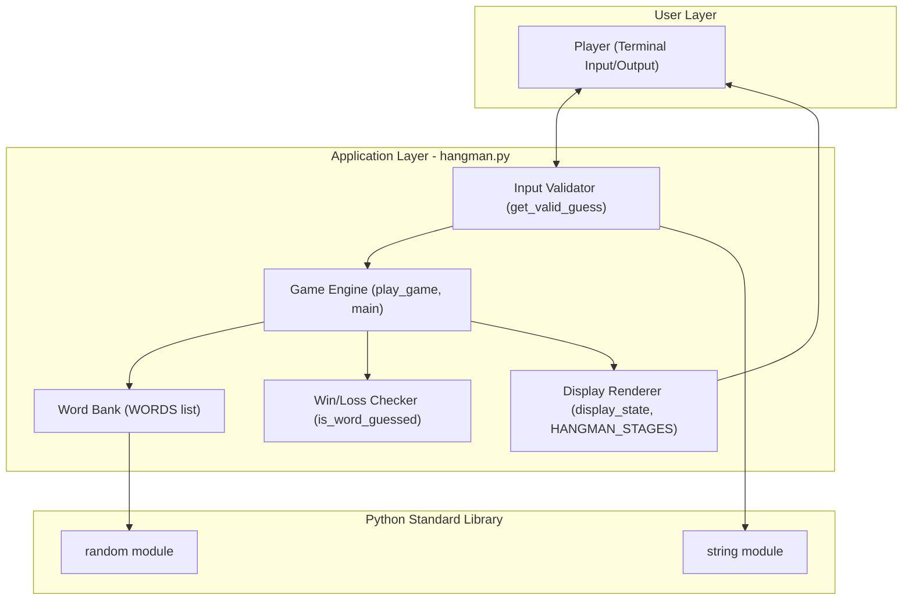
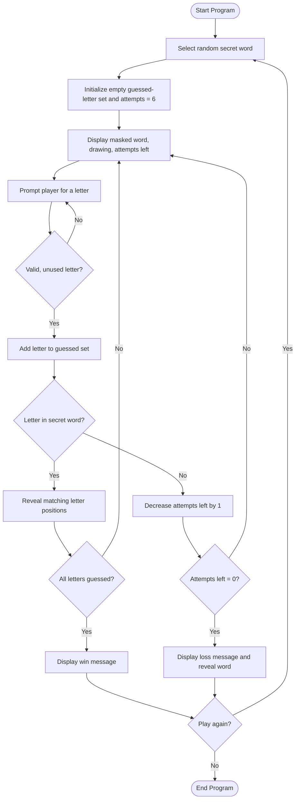
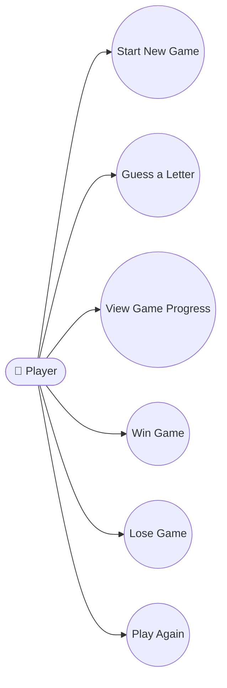
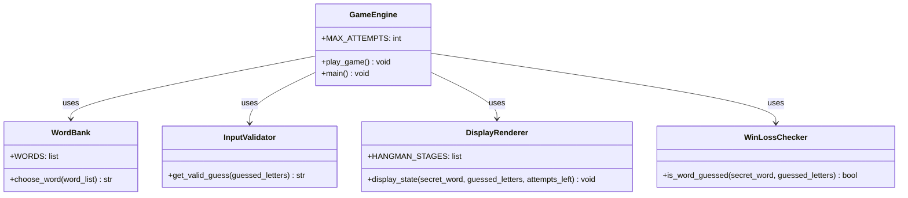
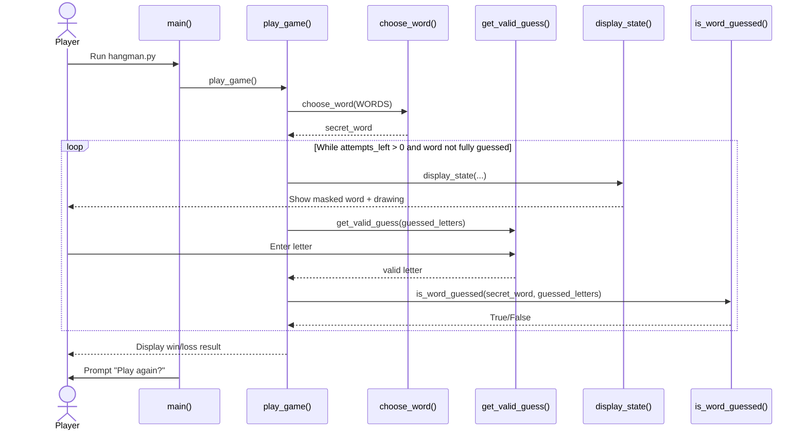

# Design Diagrams

All diagrams are written in [Mermaid](https://mermaid.js.org/) syntax.
They render automatically on GitHub, GitLab, and most Markdown
viewers (including VS Code with the "Markdown Preview Mermaid
Support" extension).

---

## 1. System Architecture Diagram

**Notes:** The game has no external database, network layer, or
third-party services — it is a single self-contained console
application, so the architecture is intentionally simple: one
process, in-memory state only.

---

## 2. Process / Workflow Diagram

---

## 3. Use Case Diagram

> Mermaid has no native UML use-case shape, so use cases are shown as
> rounded nodes connected to the actor, which is the standard
> workaround for representing use-case diagrams in Mermaid.

---

## 4. Class / Component Diagram

> The implementation is function-based rather than class-based, so
> this is expressed as a **component diagram**: each box is a
> logical component (a function or group of functions) rather than a
> class with attributes.

---

## 5. Sequence Diagram

---

## 6. Database / Storage Design

**Not applicable.** This project keeps all state (secret word,
guessed letters, attempts remaining) in memory for the duration of a
single run using a Python `list` and `set`. No file, database, or
persistent storage is used, so no ER diagram or schema design applies.
If a future enhancement adds persistent high scores (see
`PROJECT_REPORT.md`, Future Enhancements), a simple single-table
schema (`player_name`, `words_won`, `date`) would be introduced at
that point.
